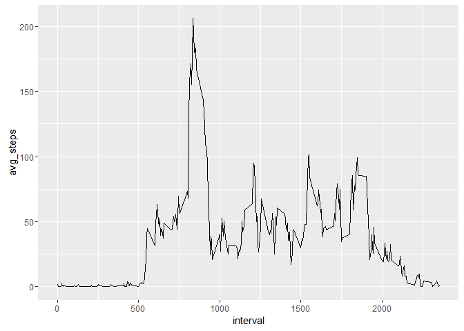

# Coursera: Reproducable Research Project 1
Tim Anderson  
May 28, 2016  


**Objective**  
To answer several questions regarding a set of fitness tracker data  

**Part One:** Bring the data into the R environment


```r
#Get the Data; Note: CSV file resides in working directory
activity <- read.csv("activity.csv")
activity$date <- as.Date(activity$date)
#Set up the environment
library(dplyr)
```

```
## 
## Attaching package: 'dplyr'
```

```
## The following objects are masked from 'package:stats':
## 
##     filter, lag
```

```
## The following objects are masked from 'package:base':
## 
##     intersect, setdiff, setequal, union
```

```r
library(ggplot2)
library(lubridate)
```

```
## 
## Attaching package: 'lubridate'
```

```
## The following object is masked from 'package:base':
## 
##     date
```

**Part Two:** Calculate the total number of steps per day, plot a histogram, and report the mean & median


```r
        #Summarize data by data

by_day <- activity %>%
  filter(!is.na(steps)) %>%
  group_by(date) %>%
  summarize(steps = sum(steps)) %>%
  print
```

```
## Source: local data frame [53 x 2]
## 
##          date steps
##        (date) (int)
## 1  2012-10-02   126
## 2  2012-10-03 11352
## 3  2012-10-04 12116
## 4  2012-10-05 13294
## 5  2012-10-06 15420
## 6  2012-10-07 11015
## 7  2012-10-09 12811
## 8  2012-10-10  9900
## 9  2012-10-11 10304
## 10 2012-10-12 17382
## ..        ...   ...
```

```r
  hist(by_day$steps)
```


```r
  mean(by_day$steps) #Mean number of steps per day
```

```
## [1] 10766.19
```

```r
  median(by_day$steps)  #Median number of steps per day
```

```
## [1] 10765
```


**Part Three:** Examine the daily activity pattern, plot the mean number of steps by time interval, and identify the time interval with the maximum number of steps


```r
  #Summarize data by five minute interval
  by_interval <- activity %>%
      filter(!is.na(steps)) %>%
      group_by(interval)%>%
      summarize(avg_steps = mean(steps))
     
      
  qplot(interval, avg_steps, data=by_interval, geom = "line")
```



```r
  max_interval <- which(by_interval$avg_steps==max(by_interval$avg_steps)) 
  #looking for table row numbers where the average steps is equal to the max. 
  #If there are multiple intervals with that number, they will be repoted below
  
  by_interval[max_interval,]
```

```
## Source: local data frame [1 x 2]
## 
##   interval avg_steps
##      (int)     (dbl)
## 1      835  206.1698
```

**Part Four:** Impute missing values. My strategy for dealing with missing data will be to replace NAs with the mean for that time interval.


```r
 activity_na_fixed <- activity
 m <- is.na(activity_na_fixed$steps)
 sum(m) #Total number of time intervals with NA steps
```

```
## [1] 2304
```

```r
 #Stategy for dealing with NA steps will be to identify them, and replace with the mean for that interval
 missing <- which(is.na(activity_na_fixed$steps))
 
 for (i in missing){ #will go through each missing value and find cooresponding mean 
      x <- which(activity_na_fixed[i,3]==by_interval$interval)
      activity_na_fixed[i,1] <- by_interval[x,2] 
 }
 
  by_day2 <- group_by(activity_na_fixed,date)
  by_day2 <- summarize(by_day2,total_steps = sum(steps,na.rm=TRUE))
  
  
  hist(by_day2$total_steps)
```


```r
  mean(by_day2$total_steps) 
```

```
## [1] 10766.19
```

```r
  median(by_day2$total_steps)  
```

```
## [1] 10766.19
```

Replacing the missing values clearly shifted the histogram, mean and median upward. Interestingly, the mean and median are now equal. This makes sense as I inserted a bunch of numbers right there in the middle of the dataset.

**Part Five:** Weekend versus weekday.  Are there differences in activity patterns?


```r
#adding a column to the dataset, looking at the date to see if it's a Sat or Sun, if so adding weekend, else adding Weekday
activity_na_fixed <- mutate(activity_na_fixed, weektype = ifelse(weekdays(activity_na_fixed$date) == "Saturday" | weekdays(activity_na_fixed$date) == "Sunday", "weekend", "weekday"))
activity_na_fixed$weektype <- as.factor(activity_na_fixed$weektype)
head(activity_na_fixed)
```

```
##       steps       date interval weektype
## 1 1.7169811 2012-10-01        0  weekday
## 2 0.3396226 2012-10-01        5  weekday
## 3 0.1320755 2012-10-01       10  weekday
## 4 0.1509434 2012-10-01       15  weekday
## 5 0.0754717 2012-10-01       20  weekday
## 6 2.0943396 2012-10-01       25  weekday
```

```r
by_interval2 <- activity_na_fixed %>%
  group_by(interval, weektype) %>%
  summarise(steps = mean(steps))

line_graphs <- ggplot(by_interval2, aes(x=interval, y=steps, color = weektype)) + geom_line() +
  facet_wrap(~weektype, ncol = 1, nrow=2)

print(line_graphs)
```


